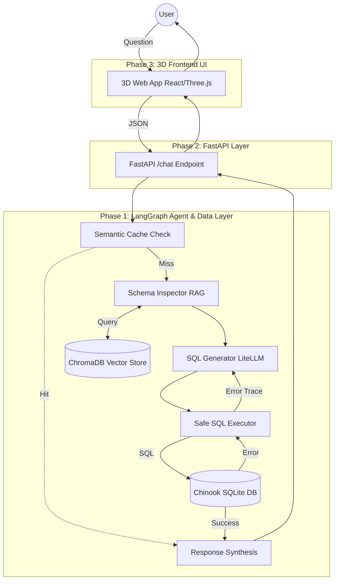

# Self-Healing Text-to-SQL Agent

An autonomous, self-healing Text-to-SQL agent built with Python, LangGraph, LiteLLM, ChromaDB, and SQLite.

## Architecture



## Setup Instructions

1. **Clone and Setup Virtual Environment:**
```bash
python3 -m venv venv
source venv/bin/activate
pip install -r requirements.txt
```

2. **Download the Database:**
```bash
curl -L https://raw.githubusercontent.com/lerocha/chinook-database/master/ChinookDatabase/DataSources/Chinook_Sqlite.sqlite -o chinook.db
```

3. **Configure API Keys:**
Duplicate `.env.template` to `.env` and add your `GEMINI_API_KEY`.

4. **Run the Automated Tests:**
```bash
pytest test_agent.py -v
```

5. **Start the API Server:**
```bash
uvicorn app:app --reload
```
