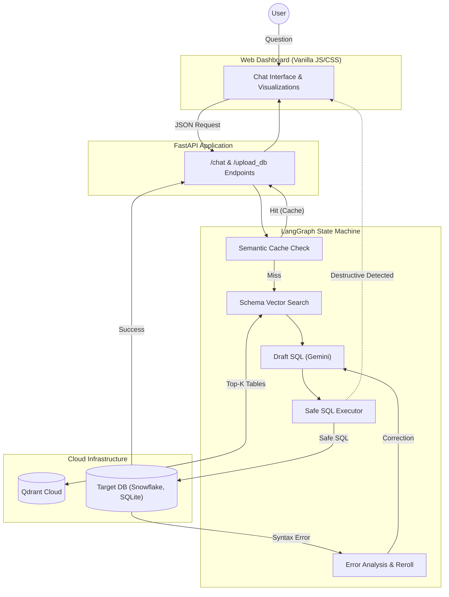

# Autonomous SQL Agent

An autonomous, self-healing Text-to-SQL agent built with Python, LangGraph, Google Gemini, Qdrant Cloud, and FastAPI. 

This project democratizes data access by allowing non-technical users to query complex databases using plain English. It is built with enterprise security and reliability in mind, solving the core issues of traditional NL2SQL systems: schema hallucination, destructive query execution, and high latency.

## 🌟 Key Features

1. **Self-Healing LLM Loop:** If the AI generates syntactically incorrect SQL, the system catches the database error, feeds the stack trace back to the AI, and prompts it to fix its own mistake autonomously (up to 3 retries).
2. **Zero-Trust Security (HITL):** A deterministic security layer intercepts any destructive queries (e.g., `DROP`, `DELETE`, `UPDATE`) and requires manual Human-In-The-Loop approval before the query can touch the database.
3. **Schema RAG via Qdrant:** Instead of passing massive database schemas directly to the LLM, the system generates embeddings of the schema using `sentence-transformers` and stores them in Qdrant. It retrieves only the relevant table structures for the current query, preventing hallucination.
4. **Smart Semantic Caching:** Successful queries are stored in Qdrant's vector cache. If a new question is semantically identical (>85% match), the system instantly returns the cached result—eliminating API latency and LLM costs.
5. **Multi-Database Support:** Natively connects to local SQLite files (via drag-and-drop browser uploads) or remote enterprise data warehouses like Snowflake, PostgreSQL, and MySQL.

## 🏛️ Architecture



## 🚀 Setup & Deployment

### 1. Prerequisites
- Python 3.9+
- A Google Gemini API Key
- A Qdrant Cloud Cluster URL and API Key (Free tier works perfectly)

### 2. Local Setup
```bash
# Clone the repository
git clone https://github.com/yourusername/autonomous-sql-agent.git
cd autonomous-sql-agent

# Setup virtual environment
python3 -m venv venv
source venv/bin/activate
pip install -r requirements.txt

# Configure Environment Variables
cp .env.template .env
# Edit .env and add your GEMINI_API_KEY, QDRANT_URL, and QDRANT_API_KEY
```

### 3. Running the Server
```bash
uvicorn app:app --reload
```
Open `http://localhost:8000` in your browser to access the beautiful glassmorphism dashboard. You can upload a `.sqlite` file directly through the UI to start querying!

### 4. Running the Test Suite
The project includes a robust `pytest` suite testing all core logic across both local SQLite and remote Snowflake.
```bash
pytest tests/ -v
```

## 🛠️ Tech Stack
- **AI/LLM:** Google Gemini (`gemini-1.5-flash`), LiteLLM, LangGraph, Langchain Tools
- **Backend:** FastAPI, Uvicorn, Python, SQLAlchemy
- **Vector Search:** Qdrant Client, `sentence-transformers`
- **Frontend:** HTML5, Vanilla JavaScript, CSS3, Chart.js

## 📄 License
This project is licensed under the MIT License - see the [LICENSE](LICENSE) file for details.
